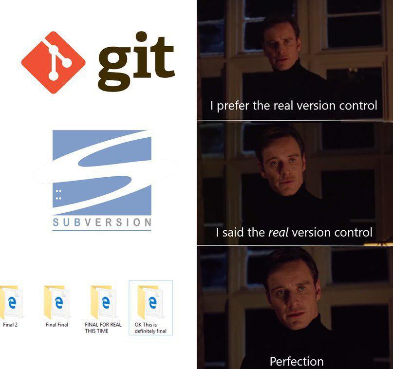

## Описание и применение

Для начала необходимо разобраться, что такое *Система управления версиями* (система контроля версий,Version Control System, VCS)?

***Система управления версиями*** - это программное обеспечение для облегчения работы с изменяющейся информацией. Зачастую разработчикам необходим доступ не только к актуальной версии документа, но и к более ранним версиям, а так же к исходным кодам. Это позволяет отследить кто, когда и какие именно изменения сделал. 

Кто-то скажет, что можно просто хранить несколько версий документа и при необходимости обращаться к ним. Такой способ возможен, но не очень эффективен. Во-первых, придется хранить огромное множество идентичных копий, чтобы отследить каждое действие в документе. Во-вторых, все эти копии необходимо держать в строгом порядке, чтобы не путаться в последовательности. Да и вообще, если что-то можно автоматизировать - зачем делать это вручную?

### Что нам дает git:
 - создание разных вариантов одного документа (ветки) с историей изменения.
 - разделение и слияние версий.
 - отслеживание изменений в файле.
 - внесение коммитов. 
 - контроль прав доступа (ограничение действий).
 - удаленный доступ к репозиториям. 