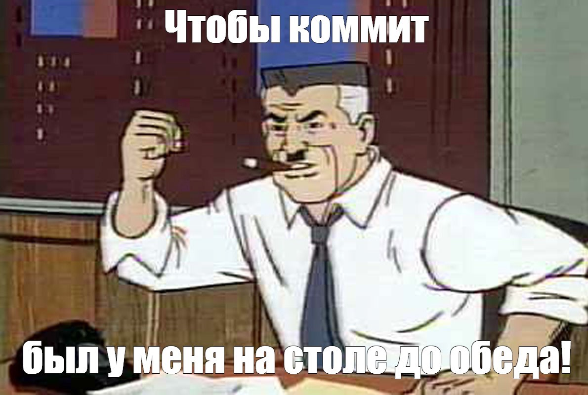

## Коммит

***Коммит*** - это основной объект в управлении контроля версий. Именно в нем содержатся все изменения за время. 

Как это происходит? Для начала создается первый коммит. Далее идет второй. Таким образом мы можем отследить информацию. Коммит включает в себя: 
- уникальный идентификатор коммита, по которому можно его найти;
- имя автора коммита, который создал его;
- дату создания коммита;
- комментарий, который описывает, что было сделано во время этого коммита.

